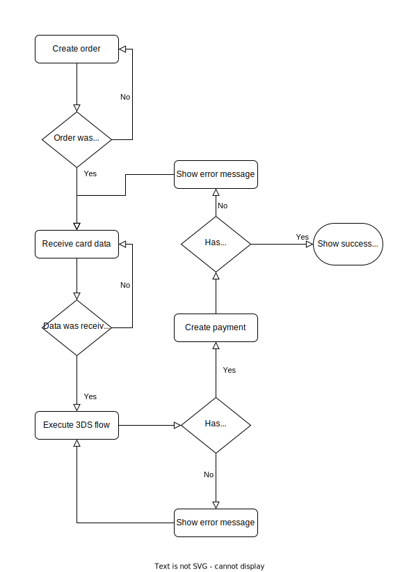

# ThreeDSecure Service

A library to simplify the implementation of 3DS flow using Paybyrd API.

## How to install

```npm i @paybyrd/threedsecure-service```

## How to configure ThreeDSecureService

### Parameters

* **options:** The service configurations object.
* **logger:** A notification object to log what is happening inside the service. **DEFAULT: RestLogger**
* **httpClient:** A client used to send the API requests.
* **directoryServer:** A service to allow customizations to the Directory Server.
* **challenge:** A service to allow customizations to the Challenge.

#### The options param

* **container:** HTML Element where the iframe needed to execute the challenge will be created. The iframe will be resizable as the container. 
**DEFAULT: document.body**
* **challengeWindowSize:** The challenge window size configuration.
* **onIFrameCreatedFn:** A notification function to allow customizations to the iframe created.
* **onIFrameReadyFn:** A notification function to allow customizations to the iframe ready.
* **onContainerCreatedFn:** A notification function to allow customizations to the container created. If the container is passed, the function will be dispatched anyway.
* **threeDSecureUrl:** Paybyrd ThreeDSecure API base URL. **DEFAULT: https://threedsecure.paybyrd.com**
* **culture**: The culture that should be used for API responses. **DEFAULT: en-US**
* **maxAttempts:** The max attempts when the API returns transient errors, like 409, 404 or 504 status codes. **DEFAULT: 50**
* **attemptDelayInSeconds:** The amount of time in milliseconds to wait for the next attempt when some transient error happens.**DEFAULT: 2**
* **timeoutInSeconds:** The amount of time in seconds to wait for the API response. **DEFAULT: 30**
* **logUrl:** A Log API base URL used to send the logs.**DEFAULT: null**
* **batchLogIntervalInSeconds:** The amount of time in seconds to send batch logs to the rest logger. **DEFAULT: 5**


```js
const container = document.getElementById('container-3ds');
const threeDSecureUrl = 'https://threedsecure.paybyrd.com';
const maxAttempts = 50;
const attemptDelay = 2000;
const culture = 'en-US';

const threeDSService = new ThreeDSecureService({
    container,
    threeDSecureUrl,
    maxAttempts,
    attemptDelay,
    culture
});
```

### How to send the paymentRequest

First of all, we truly recommend that you use the 3DS flow using the Order feature, where you can take a look [here](https://docs.paybyrd.com/docs/hosted-form-v2). When you create the order, we will return a **checkoutKey** that must be used for authentication.

```js
const createPaymentRequest = {
    type: 'Card',
    card: {
        cardNumber: '5500000000000001',
        cardHolder: 'PAYBYRD CARD HOLDER',
        cardExpiration: '07/30',
        cvv: '123'
    }
};

const createPaymentResponse = await axios.post(
    `https://gateway.paybyrd.com/api/v2/payment?checkoutKey=${checkoutKey}`,
    createPaymentRequest);
```

## How to send the request

### Parameters
* **id:** The "id" of threeDSecure node from the payment creation response.
* **correlationId:** The "requestId" from the payment creation response.

```js
const threeDSRequest = {
        id: createPaymentResponse.threeDSecure.id,
        correlationId: createPaymentResponse.requestId
    };
const threeDSResponse = await threeDSecureService.execute(threeDSRequest);
```

### How to identify errors

```js
try {
    const threeDSResponse = await threeDSecureService.execute(request);
} catch (error) {
    // Show the error.message in your website
}
```

## Flow

